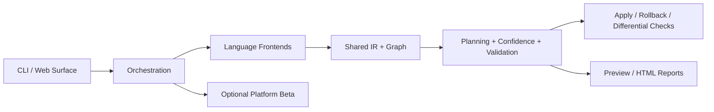

# Contributing to RefactorPilot

RefactorPilot is an open source, preview-first architectural refactoring tool. The core CLI is the product we optimize first: local, offline-capable, and safe by default.

## Local setup

1. Install Node.js 20 or newer.
2. Clone the repo.
3. Run `npm test`.
4. Try the CLI on the bundled fixture:

```bash
node ./src/cli/index.js preview ./tests/fixtures/polyglot --field user_id --to account_id
```

There are no npm dependencies today, so setup should stay fast and reproducible on Windows, macOS, and Linux.

## Architecture at a glance



Core directories:

- `src/cli`: command entrypoints and local UX
- `src/frontends`: Go and Python analyzers
- `src/core`: graph primitives and IR helpers
- `src/engine`: planning, ambiguity ranking, dynamic analysis, apply, verification
- `src/orchestration`: workspace-level flows
- `src/patterns`: product-facing migration patterns
- `tests`: deterministic engine, scenario, and benchmark coverage

## Development workflow

Use these commands while iterating:

```bash
npm test
npm run test:performance
npm run verify:standalone
node ./benchmarks/run.js --json --auto-resolve --dynamic-analysis
```

## Adding a new migration pattern

1. Add the pattern in `src/patterns/`.
2. Register it in `src/patterns/registry.js`.
3. Add fixture coverage in `tests/patterns/` or `tests/scenarios/`.
4. Document whether it is preview-only or apply-capable.
5. Update `README.md` if the pattern is user-facing.

Pattern design rules:

- Preview-first always.
- Fail safe when confidence is low.
- Keep explanation paths human-readable.
- Prefer deterministic heuristics over hidden magic.

## Writing tests

We favor simple executable scripts over heavy frameworks.

- Use `export async function run()` for reusable tests invoked by `tests/run-tests.js`.
- Keep fixtures minimal and easy to inspect.
- Scenario matrices should encode expected outcomes explicitly.
- Performance checks belong in `tests/benchmarks/`.

## Good first issues

These are ready to turn into GitHub issues and label as `good first issue` once the repo is published:

1. Add richer `doctor` output for Windows-specific toolchain detection.
2. Improve HTML report styling for long warning lists.
3. Add TypeScript frontend fixture coverage for preview-only protocol patterns.
4. Expand `verify` command output with detected CI commands.
5. Add path-normalization tests for mixed Windows/POSIX fixture inputs.

## Review expectations

- Keep changes focused.
- Add or update tests with behavior changes.
- Call out tradeoffs and safety implications in the PR description.
- Do not widen auto-apply behavior without explicit validation coverage.
